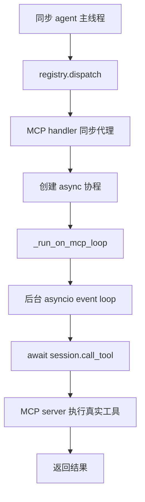

# MCP Client 初学者说明

这份文档从初学者角度解释 [tools/mcp_client.py](tools/mcp_client.py)。

你现在最需要先抓住一句话：

```text
agent 主程序是同步的，但 MCP SDK 是异步的，所以我们开了一个后台 event loop 来帮主程序执行 async / await。
```

## 先看最终目标

我们希望用户可以这样连接一个 MCP server：

```text
/mcp connect mcp_server_demo python mcp_server_demo.py
```

然后 agent 能自动发现 MCP server 里的工具，比如：

```text
get_weather
get_time
```

再把它们注册成本地工具：

```text
mcp_mcp_server_demo_get_weather
mcp_mcp_server_demo_get_time
```

最后模型调用这些工具时，agent 能把调用转发给 MCP server。

## 先理解几个概念

### 1. 同步函数

普通 Python 函数就是同步函数：

```python
def hello():
    print("hello")
```

调用它时，会一步一步执行，执行完才返回：

```python
hello()
```

你的 `agent.py` 主流程基本就是同步的：

```text
input() 等用户输入
调用模型
处理工具调用
打印结果
继续 input()
```

### 2. 异步函数

异步函数长这样：

```python
async def hello_async():
    await something()
```

它里面可以写 `await`。

但注意：不能在普通同步函数里直接写 `await`。

下面这样是不行的：

```python
def normal_function():
    await something()
```

因为 `await` 必须在 `async def` 里面。

### 3. 协程 coroutine

调用异步函数时，它不会马上执行，而是生成一个“协程对象”：

```python
async def hello_async():
    print("hello")

coro = hello_async()
```

这里的 `coro` 只是一个待执行任务。

要真正执行它，需要 event loop。

### 4. event loop

event loop 可以理解成一个专门执行异步任务的调度器。

它负责：

- 执行协程
- 处理 `await`
- 等待 IO
- 在任务可以继续时恢复执行

简单想：

```text
coroutine 是任务
event loop 是跑任务的地方
```

## 为什么这里需要后台 event loop

MCP Python SDK 的接口是异步的，比如：

```python
await self.session.initialize()
await self.session.list_tools()
await self.session.call_tool(...)
```

但我们的 agent 主程序不是异步程序。

所以我们不能在 `agent.py` 的主循环里直接到处写：

```python
await session.call_tool(...)
```

当前代码选择了一个折中方案：

```text
主线程继续跑同步 agent
后台线程专门跑 asyncio event loop
主线程需要 MCP 时，把协程交给后台 loop
```

## 整体架构图

```mermaid
flowchart LR
    User[用户] --> Agent[agent.py<br/>同步主线程]
    Agent --> Registry[registry<br/>工具注册表]
    Registry --> Handler[MCP handler<br/>同步代理函数]

    Handler --> Bridge[_run_on_mcp_loop<br/>把协程交给后台 loop]
    Bridge --> Loop[后台线程<br/>asyncio event loop]
    Loop --> Session[ClientSession<br/>MCP 客户端会话]
    Session --> Stdio[stdio<br/>stdin / stdout]
    Stdio --> Server[MCP server 子进程]

    Server --> ToolLogic[真正的工具逻辑<br/>比如 get_weather]
```



注意这里有两个重要边界：

```text
同步世界：agent.py / registry / handler
异步世界：event loop / ClientSession / MCP SDK
```

`_run_on_mcp_loop()` 就是连接这两个世界的桥。

## 第一步：创建后台 event loop

代码位置：

```python
def _ensure_mcp_loop():
```

关键代码：

```python
_mcp_loop = asyncio.new_event_loop()
```

这一行创建了一个新的 event loop。

但只是创建还不够。event loop 必须运行起来，才能执行协程。

所以代码又创建了一个后台线程：

```python
_mcp_thread = threading.Thread(
    target=_run_loop_forever,
    args=(_mcp_loop, ready),
    name="mcp-event-loop",
    daemon=True,
)
_mcp_thread.start()
```

意思是：

```text
开一个新线程
在线程里执行 _run_loop_forever(_mcp_loop, ready)
```

## 第二步：让 loop 在线程里一直运行

代码位置：

```python
def _run_loop_forever(loop, ready):
```

代码：

```python
asyncio.set_event_loop(loop)
loop.call_soon(ready.set)
loop.run_forever()
```

逐行解释。

### `asyncio.set_event_loop(loop)`

意思是：

```text
把这个 loop 设置成当前线程的 event loop
```

event loop 是和线程绑定的。

虽然 `_mcp_loop` 是主线程创建的，但它真正运行在后台线程里。所以后台线程启动后，要先把这个 loop 安装到自己身上。

### `loop.call_soon(ready.set)`

意思是：

```text
等 loop 一开始运行，就马上执行 ready.set()
```

`ready` 是主线程和后台线程之间的一个通知器。

主线程会等：

```python
ready.wait(timeout=5)
```

后台 loop 真正开始跑以后，会执行：

```python
ready.set()
```

这样主线程就知道：

```text
后台 event loop 已经准备好了
现在可以把协程交给它了
```

### `loop.run_forever()`

意思是：

```text
启动 event loop，并一直运行
```

它不会自己结束，而是一直等别人给它派任务。

后面这个函数就是派任务的：

```python
asyncio.run_coroutine_threadsafe(coro, loop)
```

## 第三步：主线程把协程交给后台 loop

代码位置：

```python
def _run_on_mcp_loop(coro, timeout=360):
```

关键代码：

```python
future = asyncio.run_coroutine_threadsafe(coro, loop)
return future.result(timeout=timeout)
```

这两行非常关键。

### `run_coroutine_threadsafe(coro, loop)`

意思是：

```text
把这个协程 coro 交给指定的 event loop 执行
```

为什么叫 `threadsafe`？

因为这里是：

```text
主线程 调用 后台线程里的 loop
```

跨线程操作 event loop，普通方法不安全，所以要用 `asyncio.run_coroutine_threadsafe()`。

### `future.result(timeout=timeout)`

这行的意思是：

```text
主线程在这里等后台 loop 执行完成，并拿回结果
```

所以整个函数的作用是：

```text
主线程不能 await
    |
    v
创建协程
    |
    v
交给后台 event loop await
    |
    v
主线程同步等待结果
```

## 一个最小例子

先定义异步函数：

```python
async def async_job():
    result = await do_something()
    return result
```

在同步函数里不能直接：

```python
await async_job()
```

所以当前项目会这样做：

```python
coro = async_job()
result = _run_on_mcp_loop(coro)
```

也就是：

```text
async_job() 生成协程
_run_on_mcp_loop() 把协程丢给后台 loop
后台 loop 负责真正执行 await
主线程等结果
```

## 连接 MCP server 时发生了什么

用户输入：

```text
/mcp connect mcp_server_demo python mcp_server_demo.py
```

`agent.py` 会调用：

```python
mcp_manager.connect(name, command, args)
```

里面会做：

```python
_ensure_mcp_loop()
```

确保后台 event loop 已经启动。

然后定义一个异步任务：

```python
async def _do_connect():
    await conn.connect(command, args)
    await conn.discover_and_register()
```

注意 `_do_connect()` 里面用了 `await`，所以它必须交给 event loop 执行：

```python
_run_on_mcp_loop(_do_connect(), timeout=30)
```

整体流程：

```mermaid
sequenceDiagram
    participant Main as 主线程 agent.py
    participant Manager as MCPManager
    participant Loop as 后台 event loop
    participant Conn as MCPConnection
    participant Server as MCP server
    participant Registry as registry

    Main->>Manager: connect(name, command, args)
    Manager->>Manager: _ensure_mcp_loop()
    Manager->>Loop: _run_on_mcp_loop(_do_connect())
    Loop->>Conn: await conn.connect(...)
    Conn->>Server: 启动并连接 stdio server
    Loop->>Conn: await conn.discover_and_register()
    Conn->>Server: list_tools()
    Server-->>Conn: 返回工具列表
    Conn->>Registry: register(schema, handler)
    Loop-->>Manager: 连接完成
    Manager-->>Main: 返回
```

## `stdio_client` 做什么

在 `MCPConnection.connect()` 里：

```python
server_params = StdioServerParameters(
    command=command,
    args=args,
)

stdio_transport = await self._exit_stack.enter_async_context(
    stdio_client(server_params)
)
read_stream, write_stream = stdio_transport
```

它做的事情可以理解成：

```text
启动子进程：python mcp_server_demo.py
拿到 read_stream：读 MCP server 的输出
拿到 write_stream：给 MCP server 写输入
```

这里的 stdio 是：

```text
agent 通过 stdin/stdout 和 MCP server 通信
```

它不是说 MCP server 不能访问网络。

MCP server 内部仍然可以：

- 调 HTTP API
- 访问数据库
- 读文件
- 执行其他 Python 逻辑

## `ClientSession` 做什么

拿到 `read_stream` 和 `write_stream` 之后，代码创建：

```python
self.session = await self._exit_stack.enter_async_context(
    ClientSession(read_stream, write_stream)
)

await self.session.initialize()
```

可以这样理解：

```text
stdio_client 负责建立管道
ClientSession 负责在管道上说 MCP 协议
```

有了 `ClientSession`，就可以调用高级方法：

```python
await self.session.initialize()
await self.session.list_tools()
await self.session.call_tool(...)
```

不用自己手写底层 JSON-RPC 消息。

## 工具是怎么注册的

连接成功后，会调用：

```python
await conn.discover_and_register()
```

里面第一步：

```python
result = await self.session.list_tools()
```

这会问 MCP server：

```text
你有哪些工具？
```

假设 server 返回：

```text
get_weather
get_time
```

代码会给工具名加前缀：

```python
tool_name = f"mcp_{self.name}_{tool.name}"
```

如果连接名是：

```text
mcp_server_demo
```

最后注册名就是：

```text
mcp_mcp_server_demo_get_weather
mcp_mcp_server_demo_get_time
```

为什么要加前缀？

因为不同 MCP server 可能都有同名工具。

例如两个 server 都有：

```text
get_weather
```

加上 server 名以后就不冲突了。

## handler 是什么

`registry` 里的工具都长这样：

```text
工具名 -> schema + handler
```

其中 `handler` 是真正执行工具的函数。

本地工具比较简单：

```text
read_file -> read_file_handler
terminal -> terminal_handler
```

但 MCP 工具比较特殊：

```text
真正的 get_weather 不在本进程
它在 MCP server 子进程里
而且调用它要 await session.call_tool(...)
```

所以注册 MCP 工具时，注册进去的 handler 不是工具本体，而是一个代理函数。

这个代理函数做：

```text
收到 registry.dispatch 的同步调用
    |
    v
创建 async _call()
    |
    v
交给后台 event loop
    |
    v
后台 loop 执行 session.call_tool(...)
    |
    v
拿到 MCP server 返回结果
```

代码位置：

```python
def _make_handler(self, server_tool_name: str):
```

核心代码：

```python
def handler(args: dict) -> str:
    async def _call():
        result = await connection.session.call_tool(server_tool_name, arguments=args)
        ...

    return _run_on_mcp_loop(_call())
```

这里又回到了前面的核心：

```text
handler 是同步函数
call_tool 是异步调用
所以 handler 里创建协程，然后交给后台 loop
```

## 模型调用 MCP 工具时的完整流程

```mermaid
sequenceDiagram
    participant Model as 模型
    participant Agent as agent.py
    participant Registry as registry
    participant Handler as MCP handler
    participant Loop as 后台 event loop
    participant Session as ClientSession
    participant Server as MCP server

    Model-->>Agent: 要调用 mcp_mcp_server_demo_get_weather
    Agent->>Registry: dispatch(tool_name, args)
    Registry->>Handler: handler(args)
    Handler->>Loop: _run_on_mcp_loop(_call())
    Loop->>Session: await session.call_tool("get_weather", args)
    Session->>Server: 通过 stdio 发送 MCP 请求
    Server-->>Session: 返回工具结果
    Session-->>Loop: 返回 result.content
    Loop-->>Handler: 返回文本
    Handler-->>Registry: 返回 str
    Registry-->>Agent: 返回工具结果
    Agent-->>Model: 把工具结果发回模型
```

## 为什么不用直接把整个 agent 改成 async

也可以那样做。

如果整个 `agent.py` 都是异步的，很多地方可以直接：

```python
await session.call_tool(...)
```

但那会让主程序、命令处理、模型调用、工具分发都一起改成 async，改动更大。

现在这个设计的好处是：

```text
agent.py 基本保持同步
只有 MCP 部分用后台 event loop 处理异步
```

所以它是一个兼容方案：

```text
同步 agent
    +
异步 MCP SDK
    =
后台 event loop + 代理 handler
```

## refresh 和 disconnect

MCP 工具注册到 `registry` 后，模型就能看到它们。

如果 MCP server 的工具列表变了，需要刷新：

```text
先 deregister 旧工具
再 list_tools
再 register 新工具
```

断开连接时，也要从 `registry` 删除这些工具。

否则模型可能还会看到一个已经不可用的工具名。

## 常见问题

### 为什么之前会出现 `MCP event loop is not running`

因为主线程刚启动后台线程，就马上把协程交给 loop。

但后台线程可能还没来得及执行：

```python
loop.run_forever()
```

所以代码现在用：

```python
ready = threading.Event()
```

让主线程等后台 loop 真正开始运行后再继续。

### 为什么会出现 `coroutine was never awaited`

因为协程对象已经创建了：

```python
_do_connect()
```

但如果还没成功交给 event loop，就抛异常了，Python 会发现：

```text
这个 coroutine 没有人 await
```

所以现在失败时会：

```python
coro.close()
```

把这个协程对象关掉。

### stdio 模式为什么不能乱 print

stdio 模式下：

```text
stdout 是 MCP 协议通道
stderr 才适合日志
```

如果 MCP server 里随便：

```python
print("debug")
```

这个内容可能会混进 MCP 协议输出里，导致客户端解析失败。

## 最小心智模型

如果只记一张图，记这个：



一句话总结：

```text
主线程不能直接 await，所以它把 async MCP 任务交给后台 event loop；handler 负责把本地工具调用转发成 MCP 工具调用。
```
