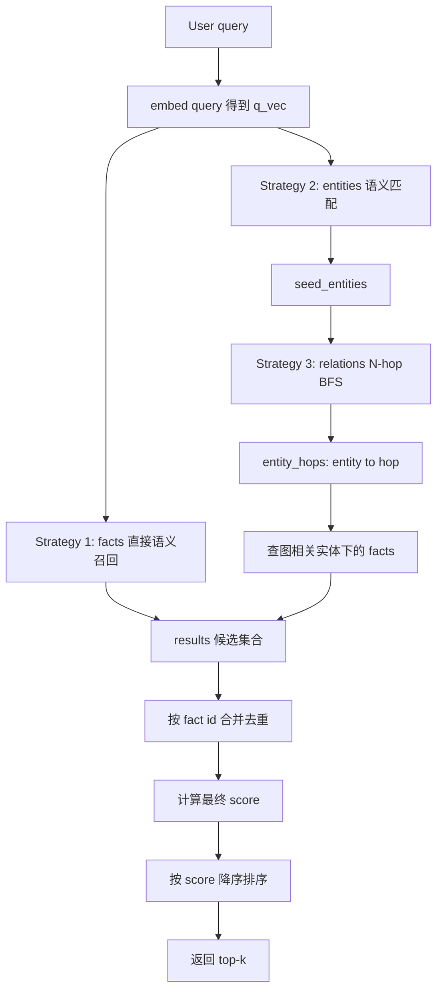

# V16 Recall 流程与评分公式

本文解释 `scripts/mock_memory_server.py` 中 `recall_multi_strategy()` 的完整过程，以及最终 `score` 的计算方式。

V16 的 recall 不是只做一次向量 top-k，而是把三种信号合并：

1. facts 的语义相似度
2. entities + relations 的知识图谱多跳扩展
3. facts 的时间衰减

对应代码入口：

```python
recall_multi_strategy(
    bank_id: str,
    query: str,
    k: int,
    tags: list[str] | None = None,
    tags_match: str = "any",
    hops: int | None = None,
)
```

## 数据模型

recall 主要使用三张表：

| 表 | 作用 |
|---|---|
| `entities` | 存实体，例如用户、项目、工具、偏好。每个实体有 embedding，用来从 query 找种子实体。 |
| `relations` | 存实体之间的边，例如 `用户 works_on hermes`、`hermes uses Python`。用于 BFS 多跳扩展。 |
| `facts` | 存最终要返回给 agent 的原子事实。每条 fact 绑定一个 `entity_name`，并有自己的 embedding。 |

简化理解：



## 配置项

相关配置在 `scripts/mock_memory_server.py` 顶部读取：

```python
RECALL_HOPS = max(1, int(os.environ.get("RECALL_HOPS", "2")))
HOP_DECAY = float(os.environ.get("HOP_DECAY", "0.7"))
DECAY_HALF_LIFE_DAYS = float(os.environ.get("DECAY_HALF_LIFE_DAYS", "30"))
DECAY_ALPHA = float(os.environ.get("DECAY_ALPHA", "0.3"))
```

含义：

| 配置 | 默认值 | 含义 |
|---|---:|---|
| `RECALL_HOPS` | `2` | 图遍历最大跳数。`1` 表示只用直接命中的种子实体，`2` 表示再查一层邻居。 |
| `HOP_DECAY` | `0.7` | 图距离衰减系数。越远的实体，关联 fact 权重越低。 |
| `DECAY_HALF_LIFE_DAYS` | `30` | 时间半衰期。fact 每过 30 天，时间权重变为原来的一半。`<=0` 表示关闭。 |
| `DECAY_ALPHA` | `0.3` | 时间衰减混合比例。`0` 表示不考虑时间，`1` 表示完全按时间权重衰减。 |

## Recall 总流程

### 1. Query 向量化

第一步把用户 query 转成 embedding：

```python
q_vec = embed(query)
```

后续的 facts 检索和 entities 检索都复用这个 `q_vec`。

如果 embedding 失败，直接返回空列表：

```python
except Exception:
    return []
```

### 2. 直接语义召回 facts

第一路候选来自 `facts` 表的向量检索：

```sql
SELECT id, text, entity_name, updated_at,
       1 - (embedding <=> query_vector) AS cosine
FROM facts
WHERE bank_id = ...
ORDER BY embedding <=> query_vector
LIMIT k * 2;
```

`embedding <=> query_vector` 是 pgvector 的 cosine distance，距离越小越相似。

代码里把距离转成相似度：

```text
cosine = 1 - cosine_distance
```

这一批结果先放入 `results`：

```python
results[fid] = {
    "_id": fid,
    "text": text,
    "entity_name": entity_name,
    "updated_at": updated_at,
    "cosine": cosine,
    "source": "semantic",
    "hop": 0,
}
```

这里 `hop = 0` 表示：这条 fact 是直接语义召回来的，不是图遍历召回来的。

如果请求带了 tags，会额外加过滤条件：

```sql
tags @> requested_tags  -- tags_match = all
tags && requested_tags  -- tags_match = any
```

### 3. 找 query 语义接近的种子实体

第二步从 `entities` 表里找与 query 接近的实体：

```sql
SELECT name, 1 - (embedding <=> query_vector) AS score
FROM entities
WHERE bank_id = ...
ORDER BY embedding <=> query_vector
LIMIT 5;
```

代码只保留相似度超过 `0.3` 的实体：

```python
seed_entities = {row[0] for row in rows if float(row[1]) > 0.3}
```

这些实体就是 BFS 的起点。

例子：

```text
query: 这个项目用什么技术栈？

seed_entities:
  hermes
```

### 4. 从种子实体做 N-hop BFS

如果存在种子实体，就进入 `_bfs_neighbors()`：

```python
entity_hops = _bfs_neighbors(conn, bank_id, seed_entities, n_hops)
```

返回值是：

```python
{
    "hermes": 1,
    "Python": 2,
    "DeepSeek": 2,
}
```

含义：

| hop | 含义 |
|---:|---|
| `1` | query 直接匹配到的种子实体 |
| `2` | 种子实体的一跳邻居 |
| `3` | 邻居的邻居 |

注意：这里的 `1` 不是图论里常见的距离 0。代码有意把“直接命中的实体”记为 `1`，这样评分时 `hop=1` 不打折。

BFS 每一层用这段 SQL 查双向邻居：

```sql
SELECT DISTINCT target_entity AS neighbor
FROM relations
WHERE bank_id = ... AND source_entity IN (...)

UNION

SELECT DISTINCT source_entity AS neighbor
FROM relations
WHERE bank_id = ... AND target_entity IN (...);
```

为什么查两边？

因为 `relations` 表里的关系是有方向的：

```text
用户   works_on  hermes
hermes uses      Python
```

但 recall 扩展时希望关系可以双向走。比如当前实体是 `hermes`，既要能找到正向的 `Python`，也要能找到反向的 `用户`。

`visited` 保存每个实体的最短 hop，避免重复访问：

```python
if name in visited:
    continue
visited[name] = hop
next_frontier.add(name)
```

### 5. 查图相关实体下面的 facts

BFS 得到 `entity_hops` 后，再从 `facts` 表里查这些实体绑定的 fact：

```sql
SELECT id, text, entity_name, updated_at,
       1 - (embedding <=> query_vector) AS cosine
FROM facts
WHERE bank_id = ...
  AND entity_name IN (...)
ORDER BY embedding <=> query_vector
LIMIT k * n_hops * 2;
```

这一步做两件事：

1. 只查图相关实体的 facts
2. 仍然按 fact 本身与 query 的语义相似度排序

也就是说，图遍历负责扩大候选范围，embedding 负责在这些候选里排优先级。

例子：

```python
entity_hops = {
    "hermes": 1,
    "Python": 2,
    "DeepSeek": 2,
}
```

那么 SQL 只会查：

```sql
entity_name IN ('hermes', 'Python', 'DeepSeek')
```

这些结果会以 `source = "graph"` 写入 `results`。

## 流程图

完整 recall 流程如下：

```mermaid
flowchart TB
    Start([recall_multi_strategy]) --> Embed["query 向量化 q_vec = embed(query)"]
    Embed --> EmbedOK{"embedding 成功?"}
    EmbedOK -- 否 --> Empty["返回空列表"]
    EmbedOK -- 是 --> Init["初始化 results 字典"]

    Init --> Semantic["直接语义召回 facts"]
    Semantic --> SemanticSQL["facts:\nORDER BY embedding <=> q_vec\nLIMIT k * 2"]
    SemanticSQL --> AddSemantic["写入 results\nsource=semantic, hop=0"]

    AddSemantic --> EntitySearch["查语义接近的 entities"]
    EntitySearch --> EntitySQL["entities:\nORDER BY embedding <=> q_vec\nLIMIT 5"]
    EntitySQL --> SeedFilter["保留 score > 0.3\n得到 seed_entities"]

    SeedFilter --> HasSeeds{"有 seed_entities?"}
    HasSeeds -- 否 --> ScoreAll["统一评分"]
    HasSeeds -- 是 --> BFSStart["从 seed_entities 开始 BFS"]

    BFSStart --> HopLoop["逐层扩展 hop=2..n_hops"]
    HopLoop --> RelSQL["relations 双向查询:\nsource_entity IN frontier\nUNION\ntarget_entity IN frontier"]
    RelSQL --> Visit["visited 记录最短 hop\nnext_frontier 进入下一层"]
    Visit --> HopDone{"达到 max_hops\n或 frontier 为空?"}
    HopDone -- 否 --> HopLoop
    HopDone -- 是 --> EntityHops["得到 entity_hops"]

    EntityHops --> GraphFacts["查 entity_hops 下挂的 facts"]
    GraphFacts --> GraphSQL["facts:\nentity_name IN entity_hops.keys\nORDER BY embedding <=> q_vec\nLIMIT k * n_hops * 2"]
    GraphSQL --> MergeGraph["按 fact id 合并\n更新更近的 hop"]
    MergeGraph --> ScoreAll

    ScoreAll --> Formula["score = cosine * hop_weight * decay_blend"]
    Formula --> SortTop["score 降序排序\n取前 k 条"]
    SortTop --> Return([返回 hits])
```



### 6. 合并重复 fact

`results` 用 fact id 做 key：

```python
results: dict[int, dict[str, Any]] = {}
```

如果一条 fact 同时被直接语义召回和图遍历召回，只保留一份。

合并规则：

```python
if existing is None:
    results[fid] = ...
else:
    if existing["hop"] == 0 or hop < existing["hop"]:
        existing["source"] = "graph"
        existing["hop"] = hop
```

含义：

1. 如果之前没有这条 fact，就新增。
2. 如果已经存在，但图路径更近，就更新它的 `hop`。
3. `hop=0` 的语义召回如果也被图命中，会被改成图命中的 hop，这样后续可以参与图距离评分。

## 最终评分公式

所有候选合并后，统一计算最终分数：

```python
final_score = cosine * hop_weight * decay_blend
```

完整公式：

$$
\mathrm{score}
= \mathrm{cosine}
\times \mathrm{hop\_weight}(d)
\times \mathrm{decay\_blend}(\mathrm{age\_days})
$$

其中：

$$
\mathrm{cosine}
= 1 - \mathrm{cosine\_distance}(\mathrm{query\_embedding}, \mathrm{fact\_embedding})
$$

$$
\mathrm{hop\_weight}(d)=
\begin{cases}
1, & d \le 1 \\
\mathrm{HOP\_DECAY}^{d-1}, & d > 1
\end{cases}
$$

$$
\mathrm{time\_weight}(a)=
\begin{cases}
1, & \mathrm{DECAY\_HALF\_LIFE\_DAYS} \le 0 \\
0.5^{\frac{a}{\mathrm{DECAY\_HALF\_LIFE\_DAYS}}}, & \mathrm{otherwise}
\end{cases}
$$

$$
\mathrm{decay\_blend}(a)=
\begin{cases}
1, & \mathrm{DECAY\_ALPHA} \le 0 \\
(1 - \mathrm{DECAY\_ALPHA}) + \mathrm{DECAY\_ALPHA} \times \mathrm{time\_weight}(a), & \mathrm{otherwise}
\end{cases}
$$

所以最终：

$$
\mathrm{score}
= \mathrm{cosine}
\times \mathrm{HOP\_DECAY}^{\max(d - 1, 0)}
\times
\left(
  (1 - \mathrm{DECAY\_ALPHA})
  + \mathrm{DECAY\_ALPHA}
  \times
  0.5^{\frac{\mathrm{age\_days}}{\mathrm{DECAY\_HALF\_LIFE\_DAYS}}}
\right)
$$

当 `DECAY_HALF_LIFE_DAYS <= 0` 或 `DECAY_ALPHA <= 0` 时，时间衰减等价于 `1.0`。

## Hop 权重示例

默认：

```text
HOP_DECAY = 0.7
```

| hop | 说明 | hop_weight |
|---:|---|---:|
| `0` | 直接语义召回，评分时按 `1` 处理 | `1.0` |
| `1` | query 直接命中的实体 | `1.0` |
| `2` | 一跳邻居 | `0.7` |
| `3` | 二跳邻居 | `0.49` |
| `4` | 三跳邻居 | `0.343` |

代码里这行把语义召回的 `hop=0` 当成不打折：

```python
hop = r["hop"] if r["hop"] >= 1 else 1
```

## 时间衰减示例

默认：

```text
DECAY_HALF_LIFE_DAYS = 30
DECAY_ALPHA = 0.3
```

`time_weight`：

| fact 年龄 | time_weight |
|---:|---:|
| 0 天 | `1.0` |
| 30 天 | `0.5` |
| 60 天 | `0.25` |
| 90 天 | `0.125` |

但最终不会完全乘上 `time_weight`，而是先混合：

```text
decay_blend = 0.7 + 0.3 * time_weight
```

所以：

| fact 年龄 | time_weight | decay_blend |
|---:|---:|---:|
| 0 天 | `1.0` | `1.0` |
| 30 天 | `0.5` | `0.85` |
| 60 天 | `0.25` | `0.775` |
| 90 天 | `0.125` | `0.7375` |

这样做的意义是：旧记忆会降权，但不会因为时间久就被完全抹掉。

## 完整打分示例

假设有一条 fact：

```text
text: hermes 使用 Python 开发
cosine: 0.82
hop: 2
age_days: 30
```

默认配置：

```text
HOP_DECAY = 0.7
DECAY_HALF_LIFE_DAYS = 30
DECAY_ALPHA = 0.3
```

计算：

$$
\mathrm{hop\_weight}
= 0.7^{2 - 1}
= 0.7
$$

$$
\mathrm{time\_weight}
= 0.5^{30 / 30}
= 0.5
$$

$$
\mathrm{decay\_blend}
= 0.7 + 0.3 \times 0.5
= 0.85
$$

$$
\mathrm{score}
= 0.82 \times 0.7 \times 0.85
= 0.4879
$$

如果另一条 fact：

```text
cosine: 0.70
hop: 1
age_days: 0
```

则：

$$
\mathrm{hop\_weight}=1.0
$$

$$
\mathrm{time\_weight}=1.0
$$

$$
\mathrm{decay\_blend}=1.0
$$

$$
\mathrm{score}
= 0.70 \times 1.0 \times 1.0
= 0.70
$$

虽然第一条 fact 的语义相似度更高，但因为它来自更远的图关系且更旧，最终可能排在第二条之后。

## 返回结果

最终结果按 `score` 降序排序：

```python
scored.sort(key=lambda x: x["score"], reverse=True)
top = scored[:k]
```

每条返回：

```python
{
    "text": "...",
    "score": final_score,
    "cosine": cosine,
    "source": "semantic" | "graph",
    "hop": hop,
    "age_days": round(age_days, 2),
    "time_weight": round(_time_weight(age_days), 4),
}
```

字段含义：

| 字段 | 含义 |
|---|---|
| `text` | 返回给 agent 的记忆文本 |
| `score` | 综合分数，决定最终排序 |
| `cosine` | fact 与 query 的原始语义相似度 |
| `source` | 候选来源，`semantic` 表示直接 fact 向量召回，`graph` 表示图遍历命中 |
| `hop` | 图距离。`0` 表示纯语义召回，没有图命中 |
| `age_days` | fact 距离当前时间的天数 |
| `time_weight` | 未混合前的时间权重 |

## 《雷雨》测试例子

项目里有两个 live test，用来对已经写入向量数据库的《雷雨》相关 facts、entities、relations 做真实 recall。

第一个只验证最终 `/recall` 结果是否相关：

```bash
.venv/bin/python scripts/test_v16_leiyu_recall.py --top 5
```

第二个会复盘算法中间过程，更适合观察本节讲的召回链路：

```bash
.venv/bin/python scripts/test_v16_leiyu_recall_trace.py \
  --query '周朴园和繁漪的冲突体现了什么？' \
  --k 5 \
  --hops 2
```

trace 脚本会直接连接 Postgres 和 embedding 端点，按服务端同一套算法打印：

```text
1. 直接语义召回 facts
2. query 语义接近的种子实体
3. BFS 多跳图遍历结果
4. 图相关实体下挂的 facts
5. 合并后的候选池
6. 最终评分拆解
```

下面是一次本地运行的中间结果快照。`id`、`age_days`、`decay_blend` 会随数据库内容和写入时间变化，实际数值可能略有不同。

Query：

```text
周朴园和繁漪的冲突体现了什么？
```

### 1. 直接语义召回 facts

这一步只看 `facts.embedding` 与 query embedding 的相似度，还没有使用图结构。

| rank | id | cosine | entity | text |
|---:|---:|---:|---|---|
| 1 | 136 | 0.8710 | 周朴园 | 周朴园限制繁漪自由以控制她 |
| 2 | 135 | 0.8319 | 周朴园 | 周朴园逼繁漪喝药以维护封建家长权威 |
| 3 | 144 | 0.7437 | 繁漪 | 繁漪对周萍的感情是病态的依赖，不是健康的爱情 |
| 4 | 137 | 0.7431 | 繁漪 | 繁漪在周家被当作"病人"和"摆设" |
| 5 | 145 | 0.7338 | 周萍 | 周萍对繁漪的感情是一时冲动和寂寞中的沉沦 |

这些候选先进入 `results`，初始标记为：

```text
source = semantic
hop = 0
```

### 2. query 语义接近的种子实体

这一步查 `entities.embedding`，找图遍历的起点。代码里阈值是 `score > 0.3`。

| rank | entity | type | score | selected |
|---:|---|---|---:|---|
| 1 | 周繁漪 | person | 0.7378 | yes |
| 2 | 周朴园 | person | 0.7149 | yes |
| 3 | 繁漪 | person | 0.6948 | yes |
| 4 | 周萍 | person | 0.5280 | yes |
| 5 | 周冲 | person | 0.5158 | yes |

得到的 `seed_entities` 是：

```text
周繁漪, 周朴园, 繁漪, 周萍, 周冲
```

### 3. BFS 多跳图遍历结果

从这些种子实体出发，沿 `relations` 表双向扩展。这里 `hops=2`，所以会拿到种子实体和它们的一跳邻居。

| hop | entities |
|---:|---|
| 1 | 周冲, 周朴园, 周繁漪, 周萍, 繁漪 |
| 2 | 《雷雨》, 侍萍, 儿子, 周朴园与周繁漪之子, 周繁漪的继子, 四凤, 太太, 封建家长, 继子, 鲁侍萍, 鲁大海 |

这里能看到图结构的作用：query 本身问的是“周朴园和繁漪”，但 BFS 把 `四凤`、`鲁侍萍`、`《雷雨》` 等间接相关实体也带进了候选范围。

### 4. 图相关实体下挂的 facts

这一步查 `entity_name IN entity_hops.keys()` 的 facts，并仍然按 fact embedding 与 query 的相似度排序。

| rank | id | cosine | hop | entity | text |
|---:|---:|---:|---:|---|---|
| 1 | 136 | 0.8710 | 1 | 周朴园 | 周朴园限制繁漪自由以控制她 |
| 2 | 135 | 0.8319 | 1 | 周朴园 | 周朴园逼繁漪喝药以维护封建家长权威 |
| 3 | 144 | 0.7437 | 1 | 繁漪 | 繁漪对周萍的感情是病态的依赖，不是健康的爱情 |
| 4 | 137 | 0.7431 | 1 | 繁漪 | 繁漪在周家被当作"病人"和"摆设" |
| 5 | 145 | 0.7338 | 1 | 周萍 | 周萍对繁漪的感情是一时冲动和寂寞中的沉沦 |
| 14 | 140 | 0.5662 | 2 | 四凤 | 四凤与同母异父的哥哥周萍相恋并怀了孩子 |
| 18 | 133 | 0.4503 | 2 | 鲁侍萍 | 侍萍因被命运反复碾压而精神崩溃 |

前五条来自 hop=1 的直接相关实体，所以不会被图距离降权。后面的 `四凤`、`鲁侍萍` 来自 hop=2，最终评分时会乘上：

$$
\mathrm{hop\_weight}(2) = 0.7
$$

### 5. 合并后的候选池

直接语义召回和图召回可能命中同一条 fact。合并后以 fact id 去重，并保留更近的 hop。这个例子里，直接语义 top facts 同时被图命中，所以从：

```text
source = semantic, hop = 0
```

更新为：

```text
source = graph, hop = 1
```

合并后的前几条候选：

| id | source | hop | cosine | entity | text |
|---:|---|---:|---:|---|---|
| 136 | graph | 1 | 0.8710 | 周朴园 | 周朴园限制繁漪自由以控制她 |
| 135 | graph | 1 | 0.8319 | 周朴园 | 周朴园逼繁漪喝药以维护封建家长权威 |
| 144 | graph | 1 | 0.7437 | 繁漪 | 繁漪对周萍的感情是病态的依赖，不是健康的爱情 |
| 137 | graph | 1 | 0.7431 | 繁漪 | 繁漪在周家被当作"病人"和"摆设" |
| 145 | graph | 1 | 0.7338 | 周萍 | 周萍对繁漪的感情是一时冲动和寂寞中的沉沦 |
| 140 | graph | 2 | 0.5662 | 四凤 | 四凤与同母异父的哥哥周萍相恋并怀了孩子 |
| 133 | graph | 2 | 0.4503 | 鲁侍萍 | 侍萍因被命运反复碾压而精神崩溃 |

### 6. 最终评分拆解

最后一步才把 `cosine`、`hop_weight` 和 `decay_blend` 乘起来：

| rank | id | score | cosine | hop_weight | decay_blend | source | hop | text |
|---:|---:|---:|---:|---:|---:|---|---:|---|
| 1 | 136 | 0.8708 | 0.8710 | 1.0000 | 0.9998 | graph | 1 | 周朴园限制繁漪自由以控制她 |
| 2 | 135 | 0.8318 | 0.8319 | 1.0000 | 0.9998 | graph | 1 | 周朴园逼繁漪喝药以维护封建家长权威 |
| 3 | 144 | 0.7436 | 0.7437 | 1.0000 | 0.9999 | graph | 1 | 繁漪对周萍的感情是病态的依赖，不是健康的爱情 |
| 4 | 137 | 0.7430 | 0.7431 | 1.0000 | 0.9998 | graph | 1 | 繁漪在周家被当作"病人"和"摆设" |
| 5 | 145 | 0.7338 | 0.7338 | 1.0000 | 0.9999 | graph | 1 | 周萍对繁漪的感情是一时冲动和寂寞中的沉沦 |

这组例子里，最终前五条都是 hop=1，`hop_weight=1.0`，且事实刚写入不久，`decay_blend` 接近 1。因此最终排序基本由 `cosine` 决定。hop=2 的 `四凤`、`鲁侍萍` 相关 facts 虽然进入了候选池，但会被 `HOP_DECAY=0.7` 降权，除非它们的语义相似度明显更高，否则不会排到最前面。

## 一句话总结

V16 recall 先用 query embedding 找直接相关 facts，再用 query embedding 找种子实体，通过 `relations` 做 N-hop 图扩展，拿到图相关实体下的 facts，最后用：

$$
\mathrm{语义相似度}
\times
\mathrm{图距离权重}
\times
\mathrm{时间衰减权重}
$$

统一排序并返回 top-k。
