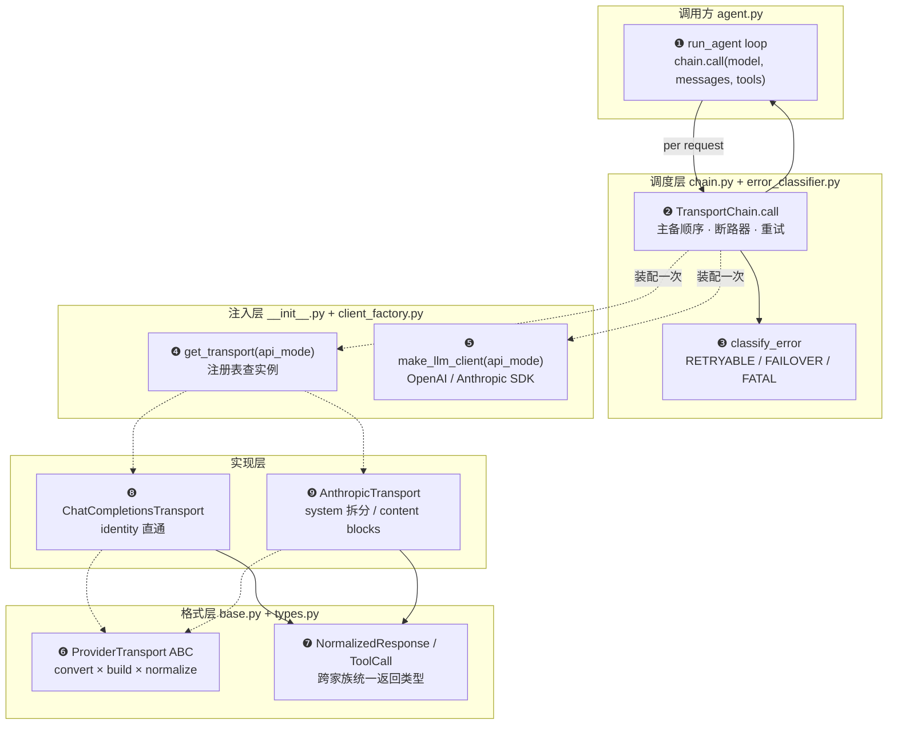
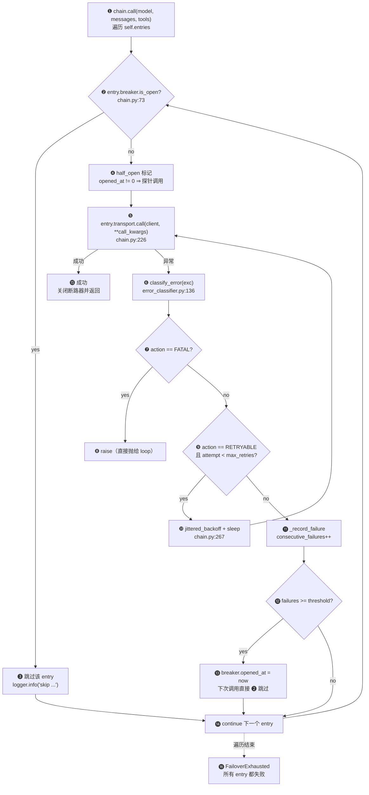
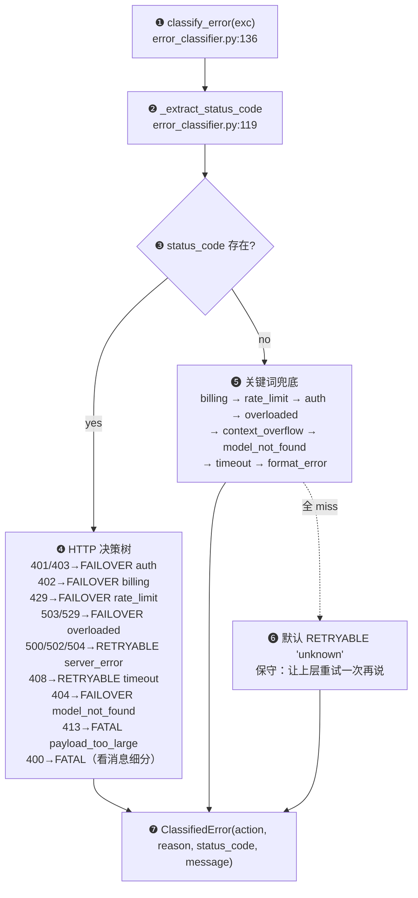
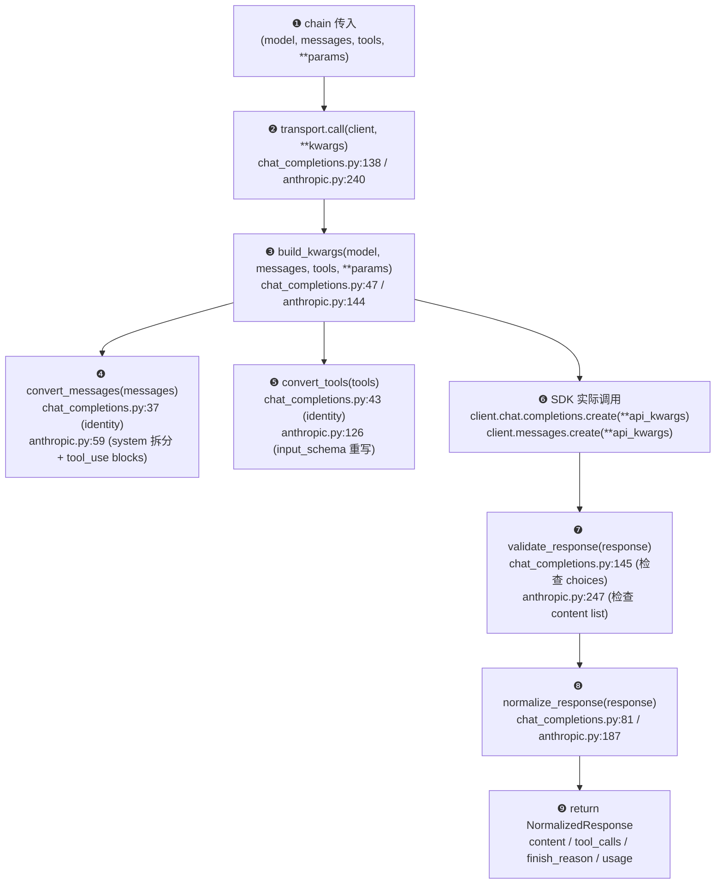
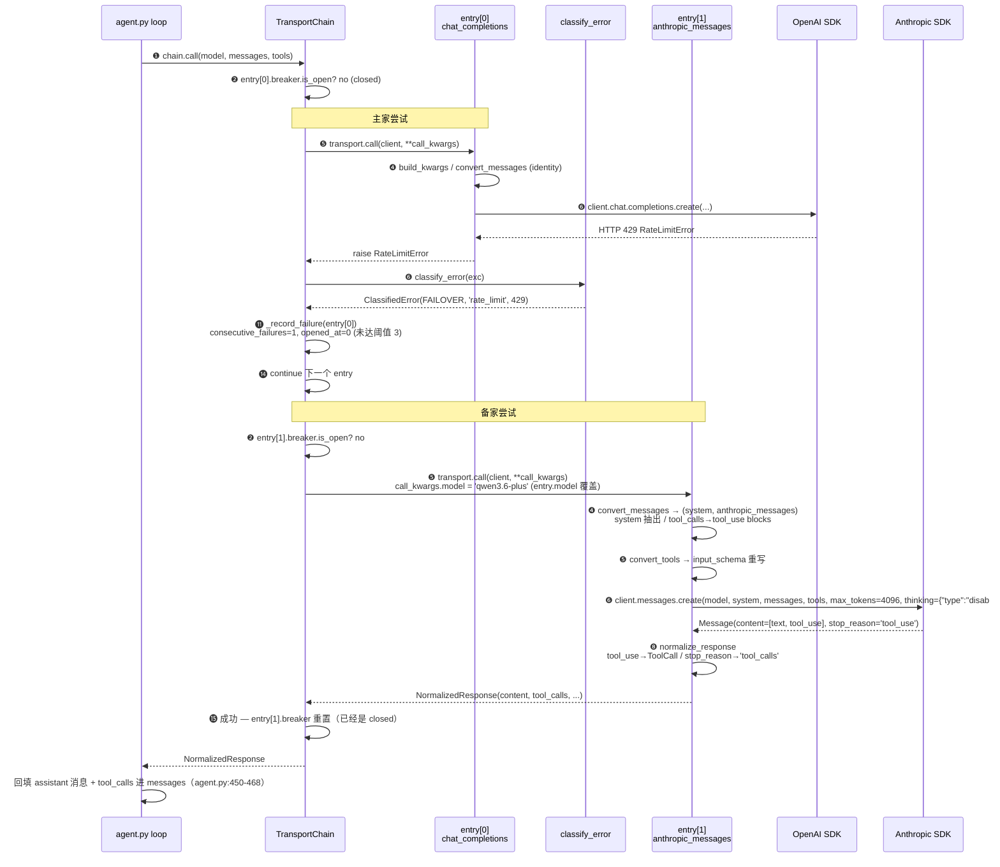

# 学习笔记：`transports/` 子系统 — 多 LLM 适配 + 故障切换

> **目的**：理解 nano_hermes_agent 怎么把 LLM 调用从「硬绑 OpenAI SDK」演进成「ABC + 注册表 + 主备链」三层抽象——agent loop 一行不动，就能在 chat_completions / anthropic_messages 之间切换，主家挂了自动切备家。全模块 8 个文件 ~1300 行（V17→V18→V19 三步演进），骨架是「**1 个 ABC + N 个实现 + 1 个注册表 + 1 个调用链 + 1 个错误分类器**」。

## 〇、一张图看全貌

**问题**：agent loop 想调一次 LLM，最朴素写法是 `client.chat.completions.create(...)`——但这把 SDK 类型、消息格式、错误处理全暴露在 loop 里，换家族就要改 loop。

**答案**：`transports/` 把这件事切成三层抽象——**格式层**（base + types + 各实现）只管「OpenAI 标准 ↔ 家族原生格式」的双向翻译；**注入层**（__init__ + client_factory）按 api_mode 字符串拿到 transport 实例和对应 SDK client；**调度层**（chain + error_classifier）在格式层之上加主备链 + 重试 + 断路器。loop 只需要 `chain.call(model, messages, tools)` 一行。



> 实线 = 每次请求路径；虚线 = 启动时一次性装配 / 类型依赖。

**图解（严格按 ❶~❾ 顺序读）**：

**❶ run_agent loop** —— 唯一的 LLM 调用入口在 [agent.py:428](../../agent.py#L428)。它只传 `model + messages + tools` 三个东西，**完全不知道**底层是 OpenAI 还是 Anthropic SDK，也不知道有没有故障切换。这条边的窄化是整个子系统的设计目的。

**❷ TransportChain.call** —— 调度层核心，定义在 [chain.py:161](../../transports/chain.py#L161)。它持有一个 `entries` 列表（多家 transport 的有序排列），每次按主备顺序尝试，每家失败就推进到下一家。具体状态机见 §三。

**❸ classify_error** —— 异常仲裁器，定义在 [error_classifier.py:136](../../transports/error_classifier.py#L136)。把 SDK 千奇百怪的异常归并成三个 `ErrorAction`：RETRYABLE（同家重试）/ FAILOVER（切下一家）/ FATAL（用户输入问题，切了也错，直接抛）。决策驱动设计——chain 不需要硬编码「看到 429 就切」，分类器一处改全局生效。

**❹ get_transport(api_mode)** —— 注册表，定义在 [__init__.py:31](../../transports/__init__.py#L31)。按 `"chat_completions"` / `"anthropic_messages"` 这种字符串拿到 transport 实例。注册表的存在让「挂第三家」是零接触新增——只要新文件末尾 `register_transport(...)`，自动发现机制 ([__init__.py:50](../../transports/__init__.py#L50)) 在第一次 `get_transport` 时 import 触发。

**❺ make_llm_client(api_mode)** —— SDK 实例化工厂，定义在 [client_factory.py:24](../../transports/client_factory.py#L24)。这是**故意**和 transport 实例分离的——transport 只管格式转换，client 才管 base_url / api_key / 超时这些部署关注点。两者解耦后，同一个 transport 可以挂在不同 endpoint 上。

**❻ ProviderTransport ABC** —— 抽象基类，定义在 [base.py:22](../../transports/base.py#L22)。规定了 5 个核心抽象方法（`api_mode` / `convert_messages` / `convert_tools` / `build_kwargs` / `normalize_response` / `call`）+ 3 个可选 hook（`validate_response` / `extract_cache_stats` / `map_finish_reason`）。所有家族的差异都收敛在这 5+3 个方法里——这就是 ABC 的合同。

**❼ NormalizedResponse / ToolCall** —— 跨家族统一返回类型，定义在 [types.py:68](../../transports/types.py#L68)。agent loop **只读这一份数据类**，不消费 OpenAI 的 `ChatCompletion` 或 Anthropic 的 `Message`。家族独有字段（如 Anthropic 的 `reasoning_details`、DeepSeek 的 `reasoning_content`）走 `provider_data` 逃生口，避免污染共享接口。

**❽ ChatCompletionsTransport** —— OpenAI 兼容实现，定义在 [chat_completions.py:30](../../transports/chat_completions.py#L30)。`convert_messages` / `convert_tools` 都是 identity——OpenAI 格式就是「事实标准」。源项目 614 行（含 16+ provider quirks）被 nano 裁到 157 行，只留核心模式。

**❾ AnthropicTransport** —— Anthropic Messages API 实现，定义在 [anthropic.py:36](../../transports/anthropic.py#L36)。这是验证 ABC 价值的关键家族——它**真的**和 OpenAI 不一样：system 是独立参数（不在 messages 数组里）、tool 调用是 `tool_use` content block（不是顶层 `tool_calls`）、tool 结果包在 user 消息的 `tool_result` block 里。所有这些差异都关在 transport 内部，loop 看不见。

**关键直觉**：「**ABC + 注册表 + 数据类**」三件套——ABC 划清接口、注册表零接触新增、数据类承担跨实现通信。每加一个 LLM 家族 = 一个新 transport 类 + 一行 `register_transport`。

## 一、它是什么

一个让 agent loop 与具体 LLM SDK 解耦的适配层。**输入**是 OpenAI 风格的 messages + OpenAI function calling tools，**输出**是统一的 `NormalizedResponse`。中间发生了什么、调了哪家 SDK、是不是切了备家——loop 一概不知。

最小用法（agent.py 里的真实片段）：

```python
from transports.chain import build_chain_from_env, FailoverExhausted
from transports.client_factory import make_llm_client

chain = build_chain_from_env(
    "chat_completions:deepseek-chat,anthropic_messages:qwen3.6-plus",
    client_factory=make_llm_client,
)

normalized = chain.call(
    model="gpt-4o-mini",  # entry 没内联 model 时的回退
    messages=messages,
    tools=tools_schema,
)
# normalized.content / normalized.tool_calls / normalized.usage ...
```

## 二、文件骨架（先建立坐标系）

| 文件 | 行数 | 角色 | 引入版本 |
|---|---|---|---|
| [base.py](../../transports/base.py) | 100 | `ProviderTransport` ABC——5 核心 + 3 可选 hook | V17 |
| [types.py](../../transports/types.py) | 100 | `NormalizedResponse` / `ToolCall` / `Usage` | V17 |
| [__init__.py](../../transports/__init__.py) | 61 | 注册表 + 自动发现 | V17 |
| [chat_completions.py](../../transports/chat_completions.py) | 157 | OpenAI 兼容实现（identity 直通） | V17 |
| [client_factory.py](../../transports/client_factory.py) | 50 | `make_llm_client(api_mode)` 工厂 | V17 |
| [anthropic.py](../../transports/anthropic.py) | 265 | Anthropic Messages API 实现 | V18 |
| [error_classifier.py](../../transports/error_classifier.py) | 190 | `classify_error` 三分类决策 | V19 |
| [chain.py](../../transports/chain.py) | 350 | `TransportChain` 主备链 + 断路器 + backoff | V19 |

三步演进的脉络很清晰：
- **V17**：抽出 ABC + 注册表，单家（chat_completions）能跑——基础设施先到位。
- **V18**：加 AnthropicTransport——验证 ABC 在第二家也能跑通，**agent.py 一行不动**。
- **V19**：加 chain + classifier——主备故障切换 + 断路器自愈，单家时退化为 V18 行为。

## 三、TransportChain 的状态机：主备链怎么决策

**问题**：链上 N 个 transport，每家都可能「这次 RETRYABLE 暂时挂、需要切」、「连续 3 次挂、整家拉黑 60 秒」、「冷却完了再试探一次」——这些状态怎么纠缠？

**答案**：每个 entry 自带一个 `_BreakerState`（[chain.py:60-76](../../transports/chain.py#L60-L76)），三态机 closed/half_open/open；`call()` 主循环按 entry 顺序遍历，遇到 open 跳过，否则进 `_try_with_retry` 内层重试。下面这张图把外层主备循环和内层重试循环画在一起。



**图解（严格按 ❶~⓰ 顺序读）**：

**❶ chain.call** —— 入口在 [chain.py:161](../../transports/chain.py#L161)。签名 `call(client=None, **kwargs)` 兼容 `ProviderTransport.call`——这样 ContextCompressor 这种存量调用点（[agent.py:414](../../agent.py#L414)）传 chain 或单 transport 都能跑，零改动。`client` 参数被链显式忽略（`del client`），因为每个 entry 自带 client。

**❷ entry.breaker.is_open?** —— 断路器 open 判定见 [chain.py:73-76](../../transports/chain.py#L73-L76)：`opened_at != 0 且 (now - opened_at) < cooldown_seconds`。两个条件：曾经被打开过、且冷却还没结束。

**❸ 跳过该 entry** —— [chain.py:177-183](../../transports/chain.py#L177-L183)。日志会打剩余冷却秒数方便调试。注意此处**没有**任何重试，直接 `continue`——open 期间该家彻底沉默，让流量全压到备家上喘口气。

**❹ half_open 标记** —— [chain.py:186](../../transports/chain.py#L186) 用 `opened_at != 0.0` 判断半开探针。冷却到了但还没成功验证恢复时，整个 `_try_with_retry` 就是那次「半开探针」——成功则 ⓯ 重置，失败则 ⓭ 重新打开。

**❺ entry.transport.call** —— 真正调 SDK 的入口在 [chain.py:226](../../transports/chain.py#L226)。**关键细节**：`call_kwargs = dict(kwargs)` 是浅拷贝，`entry.model` 覆盖只影响这次调用，不污染 `kwargs` 原 dict——避免链上 entry 互相串味（每个 entry 自带自己的 model 这件事来自源项目 [run_agent.py:1742-1765](../../transports/chain.py#L88-L91) 的 fallback chain 设计）。

**❻ classify_error** —— 异常归类在 [chain.py:228](../../transports/chain.py#L228)，详细规则见 §四。chain 自己**不做**任何字符串匹配，全靠 classifier 返回的 `ClassifiedError.action` 仲裁。

**❼ action == FATAL?** —— [chain.py:236](../../transports/chain.py#L236)。FATAL 表示「用户输入问题，切了也错」（context_overflow / format_error / payload_too_large），直接 `raise` 上抛——不记账、不切家。这是 V19 重要的克制：错误分类驱动决策，不是「所有错误都切一遍」。

**❽ raise** —— FATAL 异常逃出 chain，由 agent loop 的 `except ValueError` 或更外层处理。

**❾ action == RETRYABLE 且 attempt < max_retries?** —— [chain.py:240](../../transports/chain.py#L240)。RETRYABLE（瞬时网络抖动 / 5xx / timeout）值得在**同一家**多试一次，避免无谓切换。

**❿ jittered_backoff + sleep** —— [chain.py:267-275](../../transports/chain.py#L267-L275)。公式 `base * 2^(attempt-1) + uniform(0, 0.5*delay)`，封顶 60 秒。jitter 防止多 session 同步重试形成 thundering herd——这是源项目踩过的坑，nano 原样保留。

**⓫ _record_failure** —— [chain.py:255-263](../../transports/chain.py#L255-L263)。RETRYABLE 用尽 + FAILOVER 都走这条路记一次失败。`consecutive_failures++` 是 entry 级累计，跨调用持续。

**⓬ failures >= threshold?** —— `failure_threshold` 默认 3。连续 3 次失败才打开断路器——单次抖动不会触发 open，避免误伤。

**⓭ breaker.opened_at = now** —— [chain.py:259](../../transports/chain.py#L259)。把当前 monotonic 时刻写进 `opened_at`，下次调用 ❷ 处就会判 open 跳过 cooldown 秒。

**⓮ continue 下一个 entry** —— 该家算彻底失败，主循环往后挪一格。`now = self._clock()` 在每次 entry 之间刷新，因为 `_try_with_retry` 内的 sleep 可能已经吃掉了几秒。

**⓯ 成功** —— [chain.py:189-195](../../transports/chain.py#L189-L195)。重置 `consecutive_failures = 0` 和 `opened_at = 0.0`——半开探针成功直接关闭断路器，无须额外恢复策略。

**⓰ FailoverExhausted** —— [chain.py:200](../../transports/chain.py#L200) + [chain.py:102-108](../../transports/chain.py#L102-L108)。链全挂的唯一出口；agent loop 在 [agent.py:433-435](../../agent.py#L433-L435) 捕获后打印 `[error] all transports failed` 并退出。

**关键直觉**：**「断路器三态 + 错误分类三档」二维表**——每个 entry 在任意时刻属于 closed/half_open/open 之一，每次调用结果属于 RETRYABLE/FAILOVER/FATAL 之一，乘起来 9 种组合（图里把 FATAL × 任意状态合并成 ❽）覆盖了所有路径。

## 四、错误分类器：「该不该切下一家」

**问题**：源项目 `error_classifier.py` 1058 行处理了 14 种 `FailoverReason` × 十几种 provider-specific 串匹配；nano 怎么压到 190 行还能正确决策？

**答案**：nano 只关心一个二元问题——「**该不该切下一家？**」三个 action 即可表达：RETRYABLE（同家再试）/ FAILOVER（切下家）/ FATAL（切了也错）。具体「为什么挂的」不重要，重要的是「下一步怎么办」。



**图解（严格按 ❶~❼ 顺序读）**：

**❶ classify_error(exc)** —— 入口在 [error_classifier.py:136](../../transports/error_classifier.py#L136)。它接收任何 `BaseException` 子类——OpenAI SDK 的 `RateLimitError`、Anthropic SDK 的 `APIError`、httpx 的 `TimeoutException`、甚至本地 `ValueError` 都吞得下。

**❷ _extract_status_code** —— [error_classifier.py:119-133](../../transports/error_classifier.py#L119-L133)。同时兼容两种 SDK 错误形态：`exc.status_code`（OpenAI/Anthropic SDK 直接挂）和 `exc.response.status_code`（httpx 风格）。两个都没有就返回 None。

**❸ status_code 存在?** —— 决定走 ❹ 的精确决策还是 ❺ 的兜底。

**❹ HTTP 决策树** —— [error_classifier.py:148-169](../../transports/error_classifier.py#L148-L169)。**优先级排序很关键**：
- 401/403 = auth → FAILOVER（这家 key 不行了，换家可能行）
- 402 = billing → FAILOVER（钱不够，换备用 key/家）
- 429 = rate_limit → FAILOVER（限流了，换家立刻能跑）
- 503/529 = overloaded → FAILOVER（家服务过载）
- 500/502/504 = server_error → **RETRYABLE**（瞬时，同家再试）
- 408 = timeout → RETRYABLE
- 404 = model_not_found → FAILOVER（这家没这个模型）
- 413 = payload_too_large → FATAL（消息太大，切家也是 413）
- 400 → 看消息：包含 context_overflow 关键词就 FATAL（切家也是 OOM），否则 FATAL format_error

**❺ 关键词兜底** —— [error_classifier.py:172-187](../../transports/error_classifier.py#L172-L187)。**顺序敏感**——`_BILLING_PATTERNS` 必须在 `_RATE_LIMIT_PATTERNS` 前面，否则 "credit balance limit" 会被误判成 rate_limit。整个匹配链是一个 if-elif 瀑布，先匹中就 return。

**❻ 默认 RETRYABLE 'unknown'** —— [error_classifier.py:190](../../transports/error_classifier.py#L190)。**保守哲学**：拿不准就让上层重试一次，重试两次都失败再升级为 FAILOVER（由 ❾→⓫ 路径完成）。这避免了「未知错误一次就拉黑整家」的过度反应。

**❼ ClassifiedError** —— 数据类定义见 [error_classifier.py:38-45](../../transports/error_classifier.py#L38-L45)。`action` 给 chain 决策、`reason` 进日志、`status_code` 让 FailoverExhausted 的报错信息可读。

**关键直觉**：**「先 status code 后串匹配，未知保守」三段式**——HTTP 状态码是结构化信号优先信任，关键词是兜底，全 miss 时不下定论而是让重试机制再确认一次。这就是为什么 chain 可以放心地「不写一个字符串判断」。

## 五、单次调用管道：transport 内部的 5 步流水线

**问题**：上面 §三/§四 都在讲调度，那当 chain 终于决定调某一家时，**那一家**内部经历了什么？两个家族（chat_completions / anthropic_messages）的差异有多大？

**答案**：5 步流水线 `convert_messages → convert_tools → build_kwargs → SDK call → normalize_response`，由 `transport.call()` 一次串起来（[base.py:77-83](../../transports/base.py#L77-L83) 的 ABC 合同）。chat_completions 走 identity；anthropic 在 ❶ 和 ❹ 都做了重活。



**图解（严格按 ❶~❾ 顺序读）**：

**❶ chain 传入** —— `chain.call` 透传给 `entry.transport.call(entry.client, **call_kwargs)`（[chain.py:226](../../transports/chain.py#L226)）。`call_kwargs` 里 model 已经被 entry.model 覆盖（如果有内联），messages/tools 是 OpenAI 格式。

**❷ transport.call** —— ABC 强制每个实现都要有这个统一入口（[base.py:77](../../transports/base.py#L77)）。两家实现都是 4 行：build_kwargs → SDK call → validate → normalize_response。这是 V18 引入 transport.call 的本质——**调用方不需要知道底层是 chat.completions.create 还是 messages.create**，loop 一行不动就能切家族。

**❸ build_kwargs** —— 把 model/messages/tools 加上模型参数（max_tokens / temperature / timeout / extra_body）打包成传给 SDK 的 dict。这是格式适配层，输入是「调用方意图」、输出是「SDK 形参」。

**❹ convert_messages** —— 这是两家差异最大的地方：
- chat_completions ([chat_completions.py:37-41](../../transports/chat_completions.py#L37-L41))：identity，OpenAI 格式直通。
- anthropic ([anthropic.py:59-124](../../transports/anthropic.py#L59-L124))：返回 `(system_str, messages_list)` 元组——system 消息抽出来当独立参数；assistant 的 `tool_calls` 拆成 `{type: "tool_use", id, name, input}` content blocks；tool 角色消息合并进上一条 user 的 `tool_result` blocks。这里有个微妙细节（[anthropic.py:112-115](../../transports/anthropic.py#L112-L115)）：连续多个 tool 结果会合并到同一条 user 消息里，因为 Anthropic 不允许两条相邻的 user 消息都是纯 tool_result。

**❺ convert_tools** —— OpenAI 的 `{type:"function", function:{name, description, parameters}}` vs Anthropic 的 `{name, description, input_schema}`。chat_completions 直通；anthropic ([anthropic.py:126-142](../../transports/anthropic.py#L126-L142)) 把嵌套的 `function.parameters` 提到顶层 `input_schema`。

**❻ SDK 实际调用** —— 这是模块里**唯一**真正打网络的地方。chat_completions 调 `client.chat.completions.create(**api_kwargs)`（[chat_completions.py:140](../../transports/chat_completions.py#L140)）；anthropic 调 `client.messages.create(**api_kwargs)`（[anthropic.py:242](../../transports/anthropic.py#L242)）。其他所有代码都是它周围的格式翻译。

**❼ validate_response** —— 默认实现返回 True（[base.py:87-89](../../transports/base.py#L87-L89)），各家覆写做轻量校验。chat_completions 检查 `response.choices` 非空；anthropic 检查 `content` 是 list 且非空（或 `stop_reason == end_turn`，因为 Anthropic 偶尔会返回空 content + end_turn 表示「我没有回答」）。失败抛 ValueError，被 chain 当作 RETRYABLE 处理。

**❽ normalize_response** —— 把家族原生响应翻译成 `NormalizedResponse`：
- chat_completions ([chat_completions.py:81-136](../../transports/chat_completions.py#L81-L136))：几乎是 identity，把对象属性搬到数据类。`reasoning_content`（DeepSeek/Moonshot 独有）走 `provider_data` 逃生口。
- anthropic ([anthropic.py:187-238](../../transports/anthropic.py#L187-L238))：遍历 content blocks，`type=text` 拼成 content，`type=tool_use` 转成 `ToolCall`；`stop_reason` 通过 `_STOP_REASON_MAP`（end_turn→stop / tool_use→tool_calls / max_tokens→length）映射成 OpenAI 词汇。

**❾ return NormalizedResponse** —— `(content, tool_calls, finish_reason, reasoning, usage, provider_data)` 六字段。回到 agent loop 后，[agent.py:450-468](../../agent.py#L450-L468) 把它回填成 OpenAI 风格 messages 加进对话历史——这样下一轮还能继续走同样的管道。

**关键直觉**：**「家族差异关在 ❹/❺/❽，调用骨架 ❷/❻/❼ 全家族共享」**——ABC 切的接缝刚好是「每家都不一样的格式翻译」和「每家都一样的调用骨架」之间。增加第三家（Bedrock / Codex）只需写新 ❹/❺/❽，loop 和 chain 一行不动。

## 六、端到端走一个真实请求：主家 429 切备家成功

**问题**：把上面三张图串起来——agent loop 一个 `chain.call(...)` 进去，主家返 429（rate_limit），怎么走完整条路最终从备家拿到结果？

**答案**：图里每条消息的标号对应 §三的状态机节点（❺/❻/⓮/❷/❹）和 §五的管道节点（❹e/❻e/❽e）——即同一个请求穿过两层抽象的全过程。



**图解（严格按消息顺序读）**：

**❶ chain.call** —— agent loop 一行调用就把整个故事启动了，参数 `(model, messages, tools)` 进，`NormalizedResponse` 出。

**❷ breaker.is_open?** —— closed 状态直接放行，对应 §三 Diagram B 的 ❷。

**❺/❻ 主家失败** —— 这两步合在一起完成 §三 Diagram B 的 ❺→❻ 路径：transport.call 抛 RateLimitError，classify_error 看到 429 直接判 FAILOVER（不进 RETRYABLE 重试，因为 429 切家比同家重试更快——这是 §四 ❹ HTTP 决策树的经验值）。

**⓫ _record_failure** —— consecutive_failures 从 0 涨到 1，没到阈值 3，所以 opened_at 仍然是 0——下次调用主家**还是** closed 状态，会再试一次。这种「失败一次≠拉黑」的容忍度避免了瞬时抖动误伤。

**⓮ continue** —— 主备链推进到 entry[1]。

**第二轮 ❺** —— 关键细节：`call_kwargs.model = 'qwen3.6-plus'`。entry[1] 在 build_chain_from_env 时通过 `"anthropic_messages:qwen3.6-plus"` 内联了模型名（[chain.py:330-336](../../transports/chain.py#L330-L336)），`_try_with_retry` 在 [chain.py:221-222](../../transports/chain.py#L221-L222) 用它覆盖调用方传入的 model——因为 Anthropic 端点根本不认 `gpt-4o-mini`。

**❹/❺ 格式翻译** —— 这是 §五 Diagram C 的 ❹/❺ 在 anthropic 实现下的实际行为：system 消息变独立参数；如果 messages 里有过往 tool_calls，要拆成 tool_use blocks；OpenAI tools schema 重写成 `input_schema`。

**❻ SDK 调用** —— 注意 `thinking={"type":"disabled"}` 是 DashScope Qwen 的 Anthropic 端点的硬要求（[anthropic.py:181-183](../../transports/anthropic.py#L181-L183)），不传会 400。这是「同一个 transport 因为 endpoint 不同需要带不同默认参数」的真实例子。

**❽ normalize_response** —— content blocks 里的 `text` 拼接成 `content` 字符串，`tool_use` 转成 `ToolCall(id, name, arguments=json.dumps(input))`；`stop_reason='tool_use'` 通过 `_STOP_REASON_MAP` 翻译成 `'tool_calls'`——和 chat_completions 的 finish_reason 词汇统一。

**⓯ 成功返回** —— entry[1].breaker 本来就是 closed，重置是 no-op，但代码路径仍然会跑一遍——这是 half_open 探针的统一处理逻辑（[chain.py:189-195](../../transports/chain.py#L189-L195)）。

**回填** —— [agent.py:450-468](../../agent.py#L450-L468) 把 `NormalizedResponse` 翻译回 OpenAI 风格 message dict 加进 `messages` 数组，下一轮还能走 §五的 ❹（无论是 ChatCompletionsTransport 的 identity，还是 AnthropicTransport 的再次 system 抽离）。

**关键直觉**：**chain 层和 transport 层不互相知道对方在干嘛**——chain 只看 ClassifiedError.action，transport 只看 SDK 异常。中间通过「raise 异常 → classify_error 仲裁」这个窄接口连接。这正是为什么加 chain（V19）时，V17/V18 的 transport 类**一行不用改**。

## 七、搞懂这个之后可以看什么

- [agent.py:117-176](../../agent.py#L117-L176) — chain 装配 + banner 打印的真实入口，对应 §〇 ❶。
- [agent.py:425-438](../../agent.py#L425-L438) — chain.call 的唯一调用点 + FailoverExhausted 处理。
- [context_compressor.py](../../context_compressor.py) — 摘要也走 chain（[agent.py:414](../../agent.py#L414)），享受同一套 failover；签名兼容（`compressor.compress(messages, client, model, transport=chain)`）正是 chain.call 保留 `client` 位置参数的原因。
- [docs/Transports-system/iteration-plan.md](iteration-plan.md) — V17/V18/V19 三步演进的源项目对照与裁剪决策。
- [scripts/](../../scripts/) — 已有 mock_memory_server，可以参考添加 mock LLM server 来跑 chain 故障切换的端到端测试。

## 八、读源码的几个提醒

1. **`chain.call` 签名里的 `client` 是历史包袱**——chain 自己根本不用它，`del client` 就丢了（[chain.py:170](../../transports/chain.py#L170)）。保留只为兼容 `ProviderTransport.call(client, **kwargs)` 签名，让存量调用点（`compressor.compress` 第三个位置参数）零改动接入。看到这种「形参收下立刻丢弃」别以为是 bug。

2. **entry.model 浅拷贝覆盖很关键**——[chain.py:220-222](../../transports/chain.py#L220-L222) 每次都 `dict(kwargs)` 重新拷一份再覆盖 model。如果 mutate 原 kwargs，链里下一家的 model 就会被前一家污染。读到 `dict(kwargs)` 别以为是冗余。

3. **断路器是 entry 实例属性，不是模块全局**——这意味着每个 chain 实例的断路器是独立的。多 session 场景下每个 session 自己的 chain 各自记账，互不影响。但同一个 chain 实例跨多次 `call()` 是持续累计的（这正是「连续失败 3 次才拉黑」的语义基础）。

4. **classifier 关键词顺序敏感**——[error_classifier.py:172-187](../../transports/error_classifier.py#L172-L187) 的 if-elif 瀑布顺序就是优先级。billing 必须在 rate_limit 之前——「credit balance limit」字面包含 "limit" 但语义是钱不够而不是限流。改这里要先想清楚每个 patterns 集合的边界。

5. **`thinking={"type":"disabled"}` 是端点级要求**——nano 把它写死在 AnthropicTransport.build_kwargs 里（[anthropic.py:181-183](../../transports/anthropic.py#L181-L183)）是因为 nano 默认对接 DashScope Qwen。真正接 Anthropic 官方端点时这个默认值是不需要的——但传了也不会报错，所以暂时不参数化。

## （可选）快速定位表

| 关注点 | 行号 | 关键符号 |
|---|---|---|
| ABC 5 个抽象方法 | [base.py:34-83](../../transports/base.py#L34-L83) | `convert_messages` `convert_tools` `build_kwargs` `normalize_response` `call` |
| 注册表 + 自动发现 | [__init__.py:31-61](../../transports/__init__.py#L31-L61) | `get_transport` `_discover_transports` |
| OpenAI 兼容（identity） | [chat_completions.py:30-157](../../transports/chat_completions.py#L30-L157) | `ChatCompletionsTransport` |
| Anthropic 格式翻译 | [anthropic.py:59-124](../../transports/anthropic.py#L59-L124) | `convert_messages` 返回 `(system, messages)` |
| 错误分类 HTTP 决策 | [error_classifier.py:148-169](../../transports/error_classifier.py#L148-L169) | `classify_error` status_code 分支 |
| 错误分类关键词兜底 | [error_classifier.py:172-190](../../transports/error_classifier.py#L172-L190) | 顺序敏感的 if-elif 瀑布 |
| 链主循环 | [chain.py:161-200](../../transports/chain.py#L161-L200) | `TransportChain.call` |
| 单 entry 重试 | [chain.py:204-251](../../transports/chain.py#L204-L251) | `_try_with_retry` |
| 断路器三态判定 | [chain.py:60-76](../../transports/chain.py#L60-L76) | `_BreakerState.is_open` |
| 链字符串解析 | [chain.py:302-350](../../transports/chain.py#L302-L350) | `build_chain_from_env` |
| chain 装配入口 | [agent.py:117-131](../../agent.py#L117-L131) | `build_chain_from_env(...)` |
| chain 调用入口 | [agent.py:425-438](../../agent.py#L425-L438) | `chain.call(model, messages, tools)` |


