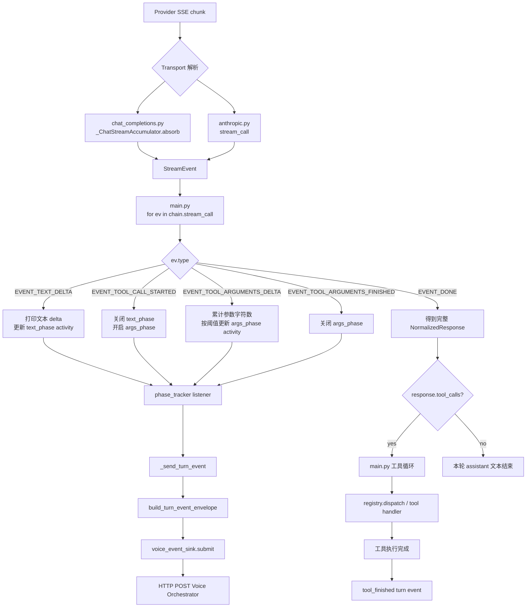
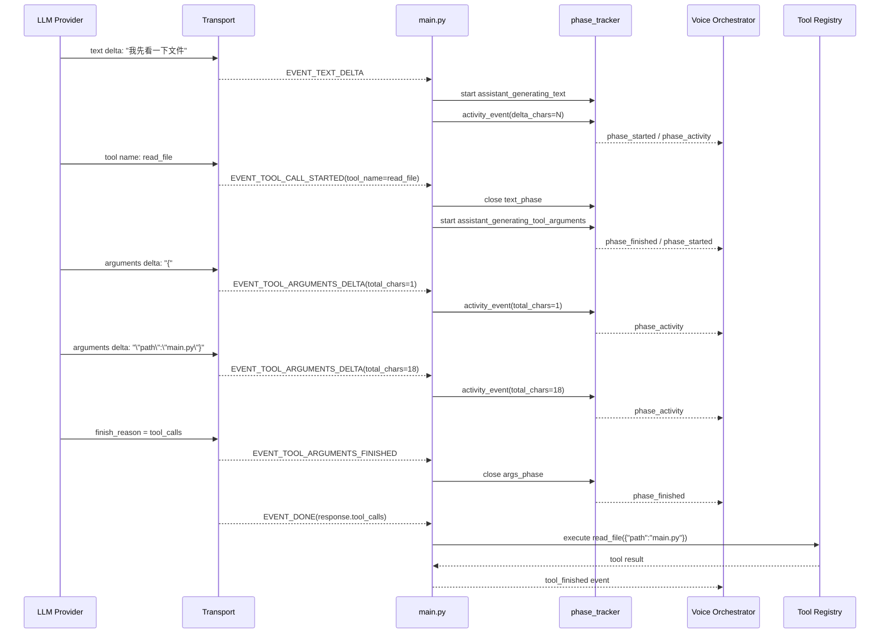
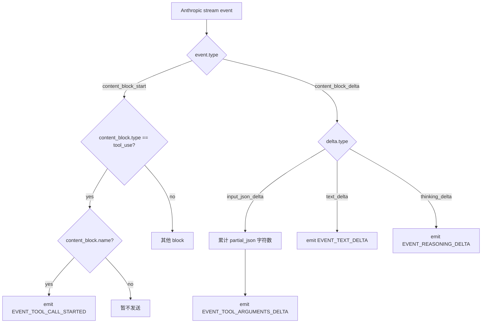
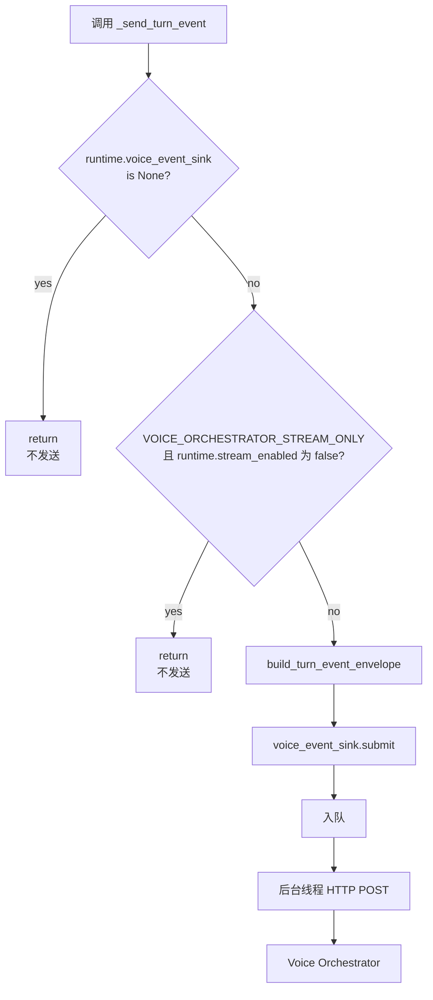
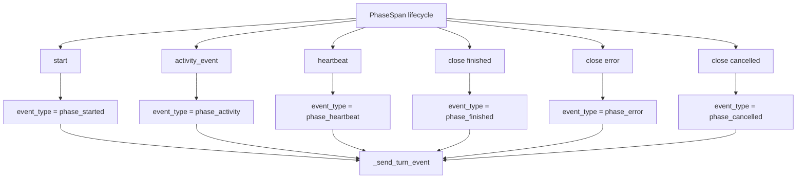
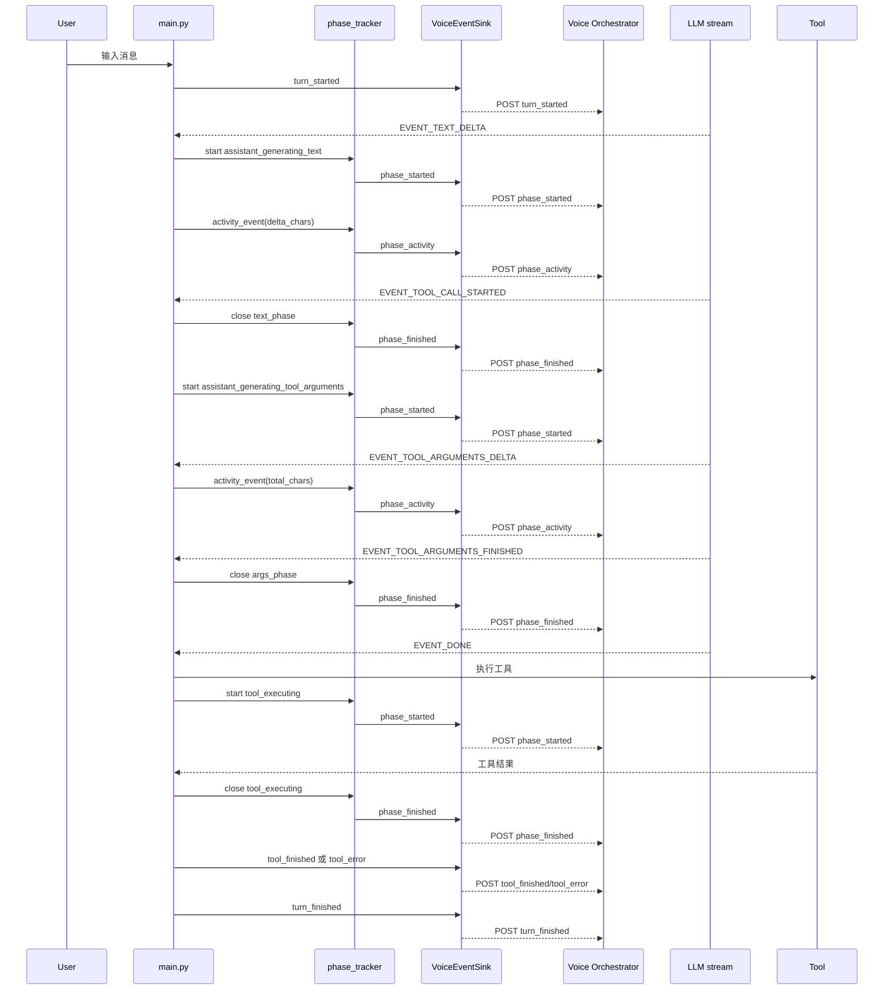
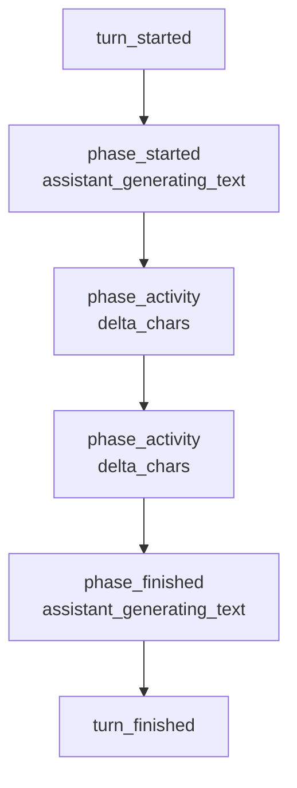
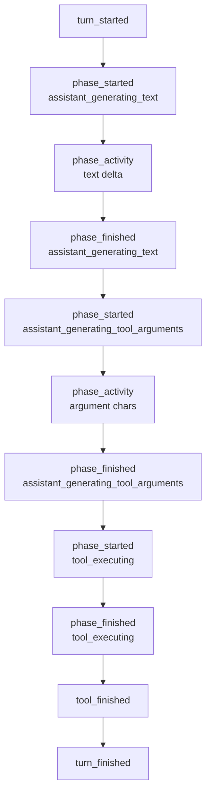
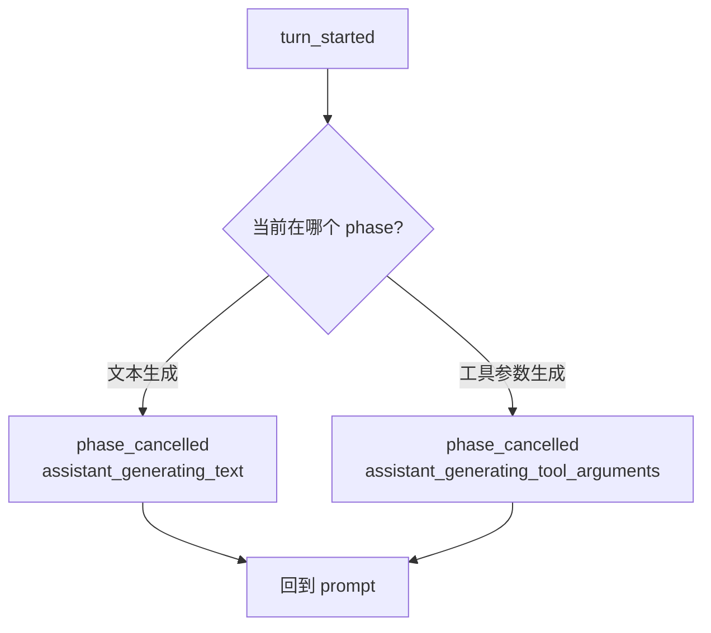

# Streaming Tool Event Pipeline

本文说明一次流式模型响应里，工具调用相关事件从 provider SSE chunk 到
`main.py`、`phase_tracker`、Voice Orchestrator 以及真正工具执行的完整流水线。

## 总体链路



## 工具调用事件顺序

`EVENT_TOOL_CALL_STARTED` 不是由 `main.py` 生成，而是 transport 在流式 chunk
里第一次知道工具名时 `yield` 出来的。它表示“模型已经选定工具”，但参数可能还在生成。



## Chat Completions 触发点

在 `transports/chat_completions.py` 中，事件来自
`_ChatStreamAccumulator.absorb(chunk)`。

```mermaid
flowchart TD
    A[chunk.choices[0].delta] --> B{delta.tool_calls?}
    B -->|no| Z[无工具事件]
    B -->|yes| C[按 tool call index 取 entry]

    C --> D{function.name?}
    D -->|yes| E[entry name = function.name]
    D -->|no| F[保持旧 name]

    C --> G{function.arguments?}
    G -->|yes| H[entry arguments += delta]
    H --> I[emit EVENT_TOOL_ARGUMENTS_DELTA]
    G -->|no| J[无参数 delta]

    E --> K{entry name 已知<br/>且 index 未 started?}
    F --> K
    I --> K
    J --> K

    K -->|yes| L[记录 started_idx]
    L --> M[emit EVENT_TOOL_CALL_STARTED]
    K -->|no| N[不重复发送 started]
```

注意：当前 Chat Completions 代码里，如果同一个 chunk 同时带 `name` 和
`arguments`，代码会先发 `EVENT_TOOL_ARGUMENTS_DELTA`，再发
`EVENT_TOOL_CALL_STARTED`。语义上仍然是“工具名一旦可知，只发一次 started；
参数每增长一段，可发多次 delta”。

## Anthropic 触发点

Anthropic 的流式协议会先发 `content_block_start`，如果这个 block 是
`tool_use`，并且已经带 `name`，transport 会立即发 `EVENT_TOOL_CALL_STARTED`。
后续 `input_json_delta` 才会产生参数增量事件。



## 语音旁路

工具事件本身不会直接播放语音。`main.py` 把运行阶段变化交给
`phase_tracker`，再由 listener 转成 turn event，最终通过
`VoiceEventSink` 发给外部 Voice Orchestrator。外部服务决定是否说、何时说、
说什么。

```mermaid
flowchart LR
    A[main.py<br/>phase_tracker.start/activity/close] --> B[PhaseSpan._emit]
    B --> C[PhaseTracker listener]
    C --> D[_send_turn_event]
    D --> E[build_turn_event_envelope]
    E --> F[VoiceEventSink.submit]
    F --> G[Queue]
    G --> H[background thread]
    H --> I[HttpVoiceOrchestratorClient.submit]
    I --> J[POST VOICE_ORCHESTRATOR_URL]
```



## 快速对照表

| 事件 | 谁生成 | 什么时候生成 | main.py 做什么 |
| --- | --- | --- | --- |
| `EVENT_TEXT_DELTA` | transport | 模型吐出可见文本增量 | 打印文本，启动/更新 `text_phase` |
| `EVENT_TOOL_CALL_STARTED` | transport | 第一次知道工具名 | 关闭文本阶段，启动工具参数阶段，打印 `[tool] ...` |
| `EVENT_TOOL_ARGUMENTS_DELTA` | transport | 工具参数 JSON 增长 | 更新参数阶段 activity，通常按字符阈值限流 |
| `EVENT_TOOL_ARGUMENTS_FINISHED` | transport | 参数流结束 | 关闭参数阶段 |
| `EVENT_DONE` | transport | 模型流式响应结束 | 拿到完整 `NormalizedResponse`，之后才真正执行工具 |

## Voice Event Sending Timeline

本节只看“什么时候会发送给 Voice Orchestrator”。语音事件的统一出口是
`main.py` 里的 `_send_turn_event(...)`：



也就是说，发送需要满足：

- `runtime.voice_event_sink is not None`
- 默认情况下 `runtime.stream_enabled == True`
- `VoiceEventSink` 通常来自环境变量 `VOICE_ORCHESTRATOR_ENABLED=1` 和
  `VOICE_ORCHESTRATOR_URL=...`

### Phase 事件如何变成语音事件

`phase_tracker` 只负责记录运行阶段。它通过 listener 接到 `_send_turn_event`：

```mermaid
flowchart LR
    A[runtime.phase_tracker.set_listener] --> B[listener: status, phase]
    B --> C[_send_turn_event(status, phase=phase)]
    C --> D[TurnEventEnvelope]
    D --> E[VoiceEventSink.submit]
```

因此下面这些 phase 操作都会发送语音事件：



`phase` payload 的核心字段来自 `PhasePreview`：

| 字段 | 含义 |
| --- | --- |
| `phase.name` | 当前阶段名，例如 `assistant_generating_text` |
| `phase.status` | 阶段事件状态，例如 `phase_started` |
| `phase.span_id` | 这段 phase 的 id |
| `phase.elapsed_ms` | 从 phase 开始到本事件的耗时 |
| `phase.activity` | 该阶段携带的安全元数据，例如 `tool_name`、`delta_chars` |

### 一轮对话的发送时间线



### Step 1: turn_started

触发位置：用户输入被加入 `messages` 后。

发送方式：

```python
_send_turn_event("turn_started")
```

发送内容重点：

| 字段 | 内容 |
| --- | --- |
| `event_type` | `turn_started` |
| `context.last_user_message_preview` | 本轮用户输入的安全预览 |
| `context.recent_messages` | 最近消息的安全预览，不包含 system prompt |
| `assistant_activity.visible_text_preview` | 空 |
| `phase` | 空 |
| `tool` | 空 |

用途：告诉 Voice Orchestrator 新一轮开始了，它可以根据用户目标决定是否开场提示。

### Step 2: assistant_generating_text started

触发条件：流式过程中第一次收到 `EVENT_TEXT_DELTA`，且 `text_phase is None`。

发送方式：

```python
text_phase = runtime.phase_tracker.start(PHASE_ASSISTANT_GENERATING_TEXT)
```

该调用会间接发送：

```text
event_type = phase_started
phase.name = assistant_generating_text
```

发送内容重点：

| 字段 | 内容 |
| --- | --- |
| `event_type` | `phase_started` |
| `phase.name` | `assistant_generating_text` |
| `phase.status` | `phase_started` |
| `phase.activity` | 初始为空 |

用途：告诉外部服务 assistant 已经开始生成可见文本。

### Step 3: assistant_generating_text activity

触发条件：每次收到 `EVENT_TEXT_DELTA`。

发送方式：

```python
text_phase.activity_event(delta_chars=len(ev.text))
```

该调用会间接发送：

```text
event_type = phase_activity
phase.name = assistant_generating_text
phase.activity.delta_chars = 本次文本增量字符数
```

发送内容重点：

| 字段 | 内容 |
| --- | --- |
| `event_type` | `phase_activity` |
| `phase.name` | `assistant_generating_text` |
| `phase.activity.delta_chars` | 本次 `ev.text` 的字符数 |
| `assistant_activity.visible_text_preview` | 通常为空；文本 delta 本身不直接放这里 |

用途：这是“assistant 仍在输出”的活动信号。它不直接发送当前 token 文本，
只发送新增字符数。

### Step 4: assistant_generating_text finished

触发条件：模型从文本输出切到工具调用，或者流式响应结束时还有未关闭的
`text_phase`。

发送方式：

```python
runtime.phase_tracker.close(text_phase)
```

该调用会间接发送：

```text
event_type = phase_finished
phase.name = assistant_generating_text
```

用途：告诉外部服务 assistant 的可见文本生成阶段结束。

### Step 5: assistant_generating_tool_arguments started

触发条件：收到 `EVENT_TOOL_CALL_STARTED`，或者先收到
`EVENT_TOOL_ARGUMENTS_DELTA` 但 `args_phase is None`。

发送方式：

```python
args_phase = runtime.phase_tracker.start(
    PHASE_ASSISTANT_GENERATING_TOOL_ARGUMENTS,
    tool_name=ev.tool_name or "",
    tool_call_id=ev.tool_call_id or "",
)
```

该调用会间接发送：

```text
event_type = phase_started
phase.name = assistant_generating_tool_arguments
phase.activity.tool_name = 工具名
phase.activity.tool_call_id = 工具调用 id
```

发送内容重点：

| 字段 | 内容 |
| --- | --- |
| `event_type` | `phase_started` |
| `phase.name` | `assistant_generating_tool_arguments` |
| `phase.activity.tool_name` | 例如 `read_file` |
| `phase.activity.tool_call_id` | provider 给出的 tool call id，可能为空 |

用途：告诉外部服务模型已经开始准备工具调用参数。此时工具还没有真正执行。

### Step 6: assistant_generating_tool_arguments activity

触发条件：收到 `EVENT_TOOL_ARGUMENTS_DELTA`，并且累计参数字符增长超过阈值。

发送方式：

```python
args_phase.activity_event(
    tool_name=ev.tool_name or "",
    tool_call_id=ev.tool_call_id or "",
    argument_field=ev.argument_field or "",
    delta_chars=ev.delta_chars,
    total_chars=total,
)
```

默认阈值：

```text
VOICE_ORCHESTRATOR_ARGUMENT_DELTA_MIN_CHARS=512
```

发送内容重点：

| 字段 | 内容 |
| --- | --- |
| `event_type` | `phase_activity` |
| `phase.name` | `assistant_generating_tool_arguments` |
| `phase.activity.tool_name` | 工具名 |
| `phase.activity.argument_field` | 通常是 `arguments` |
| `phase.activity.delta_chars` | 本次参数增量字符数 |
| `phase.activity.total_chars` | 当前已累计参数字符数 |

用途：告诉外部服务工具参数仍在增长。为了避免刷屏，不是每个小 delta 都会发送。

### Step 7: assistant_generating_tool_arguments finished

触发条件：收到 `EVENT_TOOL_ARGUMENTS_FINISHED`，或者 `EVENT_DONE` 兜底关闭。

发送方式：

```python
runtime.phase_tracker.close(
    args_phase,
    tool_name=ev.tool_name or "",
    tool_call_id=ev.tool_call_id or "",
    argument_field=ev.argument_field or "",
    total_chars=ev.total_chars,
)
```

该调用会间接发送：

```text
event_type = phase_finished
phase.name = assistant_generating_tool_arguments
```

用途：告诉外部服务工具参数生成结束，完整参数会在最终 `NormalizedResponse`
里由主循环使用。

### Step 8: phase_cancelled

触发条件：流式期间用户按 Esc 或 Ctrl+C，抛出 `StreamCancelled`。

发送方式：

```python
runtime.phase_tracker.close(args_phase, status="cancelled")
runtime.phase_tracker.close(text_phase, status="cancelled")
```

该调用会间接发送：

```text
event_type = phase_cancelled
phase.name = assistant_generating_text 或 assistant_generating_tool_arguments
```

用途：告诉外部服务当前生成阶段被用户取消。

### Step 9: tool_executing started / finished / error

触发条件：模型流结束后，主循环真正执行工具。当前 `main.py` 里 memory tool
分支显式开启 `PHASE_TOOL_EXECUTING`；registry 工具的 phase 可能由
`tools/registry.py` 包装层处理。

发送方式：

```python
_mem_phase = runtime.phase_tracker.start(
    PHASE_TOOL_EXECUTING,
    tool_name=name,
    tool_category="memory",
)
```

成功关闭：

```python
runtime.phase_tracker.close(_mem_phase, tool_name=name, result_kind=_mem_result_kind)
```

异常关闭：

```python
runtime.phase_tracker.close(
    _mem_phase,
    status="error",
    tool_name=name,
    error_type=type(exc).__name__,
)
```

发送内容重点：

| 状态 | event_type | 重点字段 |
| --- | --- | --- |
| 开始执行 | `phase_started` | `phase.name=tool_executing`, `tool_name`, `tool_category` |
| 执行成功 | `phase_finished` | `result_kind` |
| 执行失败 | `phase_error` | `error_type` |

用途：告诉外部服务 host 正在执行工具，以及执行结果状态。

### Step 10: tool_finished / tool_error

触发条件：工具执行结束后，主循环显式发送工具结果预览。当前 `main.py` 里
memory tool 分支会发送。

发送方式：

```python
_send_turn_event(
    "tool_finished" if _mem_result_kind != "error" else "tool_error",
    tool=preview_tool_result(name, _mem_result_kind, result, duration_ms=_duration_ms),
)
```

发送内容重点：

| 字段 | 内容 |
| --- | --- |
| `event_type` | `tool_finished` 或 `tool_error` |
| `tool.name` | 工具名 |
| `tool.status` | `ok`、`error`、`non_json` 等 |
| `tool.duration_ms` | 工具耗时 |
| `tool.result_head` / `tool.result_tail` | 工具结果的安全预览 |

用途：给 Voice Orchestrator 一个可播报的工具结果摘要。这里会经过截断和脱敏。

### Step 11: child_agent_running started / activity / finished

触发条件：`delegate_task` 启动子 agent。

发送方式：

```python
tracker.start(
    PHASE_CHILD_AGENT_RUNNING,
    mode=mode,
    task_count=task_count,
    completed_count=0,
    running_count=task_count,
    failed_count=0,
)
```

子任务进度更新：

```python
span.activity_event(
    mode=mode,
    task_count=task_count,
    completed_count=completed_count,
    running_count=max(0, task_count - completed_count),
    failed_count=failed_count,
)
```

结束时：

```python
tracker.close(span, status=status, **activity)
```

发送内容重点：

| 状态 | event_type | 重点字段 |
| --- | --- | --- |
| 子 agent 开始 | `phase_started` | `mode`, `task_count`, `running_count` |
| 子 agent 进度 | `phase_activity` | `completed_count`, `running_count`, `failed_count` |
| 子 agent 结束 | `phase_finished` / `phase_error` / `phase_cancelled` | 最终状态和统计 |

用途：让外部服务知道 delegate 子任务还在运行、完成了几个、失败了几个。

### Step 12: turn_finished

触发条件：本轮 tool loop 结束后。

发送方式：

```python
_send_turn_event("turn_finished", assistant_text=final_assistant_text)
```

发送内容重点：

| 字段 | 内容 |
| --- | --- |
| `event_type` | `turn_finished` |
| `assistant_activity.visible_text_preview` | assistant 最终可见文本的安全预览 |
| `context.last_user_message_preview` | 本轮用户输入预览 |

用途：告诉外部服务本轮结束，最终回答文本是什么。

## 常见路径

### 纯文本回答



### 调用一个工具



### 用户中断


